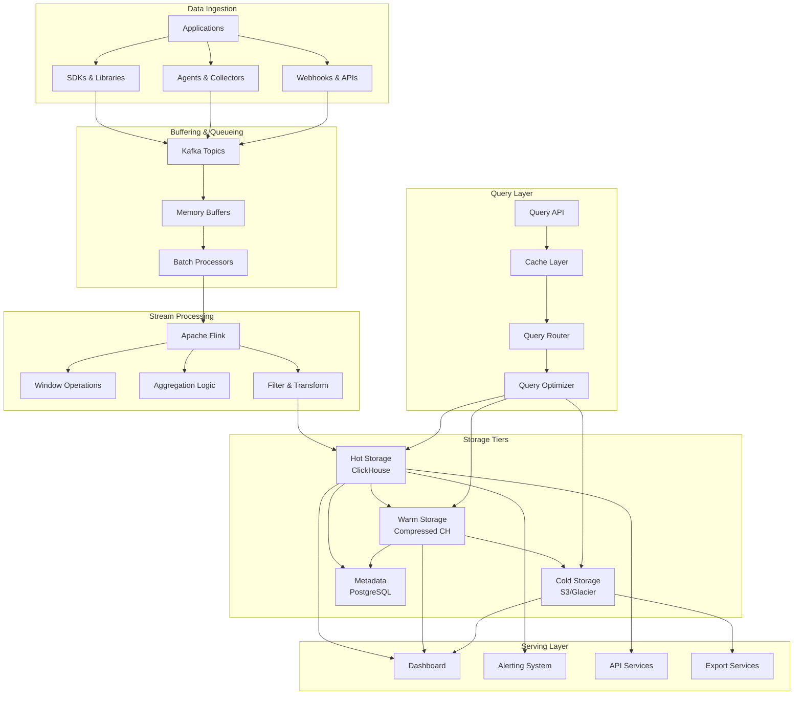
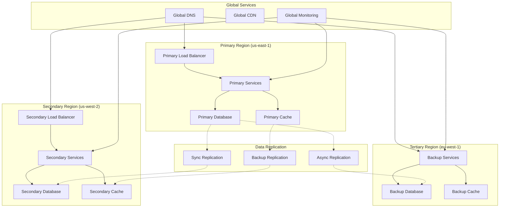

# Netflix-Level Architecture Diagram

## Global Infrastructure Architecture

```mermaid
graph TB
    subgraph "Global Edge Network"
        CDN[Global CDN<br/>CloudFlare + Fastly]
        EDGE[Edge Locations<br/>150+ PoPs]
        DNS[Global DNS<br/>Anycast]
    end
    
    subgraph "Load Balancing Layer"
        ALB[Application Load Balancer<br/>AWS ALB + NGINX]
        GLB[Global Load Balancer<br/>Route53 + Health Checks]
        WAF[Web Application Firewall<br/>CloudFlare WAF]
    end
    
    subgraph "API Gateway Layer"
        GATEWAY[API Gateway<br/>Kong + Envoy]
        AUTH[Authentication Service<br/>OAuth2 + JWT]
        RATE[Rate Limiting<br/>Redis + Sliding Window]
        ROUTE[Service Mesh<br/>Istio + Envoy]
    end
    
    subgraph "Microservices Layer"
        subgraph "Core Services"
            API[Metrics API<br/>Go + gRPC]
            COL[Collector Service<br/>Go + High Concurrency]
            PROC[Processor Service<br/>Go + Workers]
            ALERT[Alert Engine<br/>Go + ML]
        end
        
        subgraph "Data Services"
            INGEST[Ingestion Service<br/>Go + Kafka Producer]
            QUERY[Query Service<br/>Go + ClickHouse]
            STREAM[Stream Service<br/>Go + Flink]
            CACHE[Cache Service<br/>Go + Redis]
        end
        
        subgraph "Frontend Services"
            WEB[Web Dashboard<br/>React + WebSocket]
            MOBILE[Mobile API<br/>React Native]
            CLI[CLI Tools<br/>Go + Cobra]
        end
    end
    
    subgraph "Event Streaming Layer"
        KAFKA[Kafka Cluster<br/>3x5 Brokers + Replication]
        SCHEMA[Schema Registry<br/>Confluent Schema]
        CONNECT[Kafka Connect<br/>Source/Sink Connectors]
        KSQL[KSQL Engine<br/>Stream Processing]
    end
    
    subgraph "Data Storage Layer"
        subgraph "Time Series Storage"
            CH[ClickHouse Cluster<br/>3x5 Nodes + Replication]
            CH_SHARD[Sharded Storage<br/>Distributed Tables]
            CH_REPL[Replicated Storage<br/>ReplicatedMergeTree]
        end
        
        subgraph "Object Storage"
            S3[S3 Storage<br/>AWS S3 + Lifecycle]
            GLACIER[Glacier Archive<br/>Cold Storage]
            CDN_S3[CDN Storage<br/>Static Assets]
        end
        
        subgraph "Cache Layer"
            REDIS[Redis Cluster<br/>6x3 Nodes + Sentinel]
            REDIS_SHARD[Sharded Redis<br/>Consistent Hashing]
            REDIS_PERSIST[Persistent Cache<br/>RDB + AOF]
        end
        
        subgraph "Search Storage"
            ES[Elasticsearch Cluster<br/>3x3 Nodes + Sharding]
            ES_INDEX[Index Management<br/>Time-based Indices]
            ES_HOT[Hot/Warm Architecture<br/>SSD + HDD]
        end
    end
    
    subgraph "Analytics & ML Layer"
        FLINK[Apache Flink<br/>Stream Processing]
        SPARK[Apache Spark<br/>Batch Processing]
        ML[ML Platform<br/>TensorFlow + PyTorch]
        ANOMALY[Anomaly Detection<br/>Isolation Forest + LSTM]
    end
    
    subgraph "Monitoring & Observability"
        PROM[Prometheus Cluster<br/>Multi-region]
        GRAFANA[Grafana Dashboards<br/>Real-time Analytics]
        JAEGER[Jaeger Tracing<br/>Distributed Tracing]
        ELK[ELK Stack<br/>Centralized Logging]
    end
    
    subgraph "Security & Compliance"
        VAULT[HashiCorp Vault<br/>Secret Management]
        IAM[IAM Service<br/>Role-based Access]
        AUDIT[Audit Logging<br/>Compliance Storage]
        ENCRYPT[Encryption Service<br/>KMS + TLS]
    end
    
    %% Connections
    CDN --> EDGE
    EDGE --> DNS
    DNS --> GLB
    GLB --> WAF
    WAF --> ALB
    
    ALB --> GATEWAY
    GATEWAY --> AUTH
    GATEWAY --> RATE
    GATEWAY --> ROUTE
    
    ROUTE --> API
    ROUTE --> COL
    ROUTE --> PROC
    ROUTE --> ALERT
    ROUTE --> INGEST
    ROUTE --> QUERY
    ROUTE --> STREAM
    ROUTE --> CACHE
    ROUTE --> WEB
    ROUTE --> MOBILE
    ROUTE --> CLI
    
    INGEST --> KAFKA
    PROC --> KAFKA
    STREAM --> KAFKA
    KAFKA --> SCHEMA
    KAFKA --> CONNECT
    KAFKA --> KSQL
    
    KAFKA --> CH
    CH --> CH_SHARD
    CH --> CH_REPL
    QUERY --> CH
    
    CACHE --> REDIS
    REDIS --> REDIS_SHARD
    REDIS --> REDIS_PERSIST
    
    WEB --> CDN_S3
    S3 --> GLACIER
    
    STREAM --> FLINK
    FLINK --> SPARK
    SPARK --> ML
    ML --> ANOMALY
    
    KSQL --> ES
    ES --> ES_INDEX
    ES --> ES_HOT
    
    API --> PROM
    COL --> PROM
    PROC --> PROM
    WEB --> GRAFANA
    ROUTE --> JAEGER
    KAFKA --> ELK
    
    AUTH --> VAULT
    GATEWAY --> IAM
    API --> AUDIT
    CH --> ENCRYPT
```

## Data Flow Architecture

## High Availability & Disaster Recovery

## Security Architecture

```mermaid
graph TB
    subgraph "Network Security"
        VPC[VPC with Private Subnets]
        SECURITY_GROUPS[Security Groups]
        NACL[Network ACLs]
        FIREWALL[Web Application Firewall]
    end
    
    subgraph "Identity & Access Management"
        IAM_SERVICE[IAM Service]
        OAUTH[OAuth2/OIDC]
        SSO[Single Sign-On]
        MFA[Multi-Factor Auth]
    end
    
    subgraph "Data Protection"
        ENCRYPTION[Encryption at Rest & Transit]
        KEY_MANAGEMENT[Key Management Service]
        DATA_MASKING[Data Masking]
        TOKENIZATION[Tokenization Service]
    end
    
    subgraph "Monitoring & Auditing"
        AUDIT_LOG[Audit Logging]
        SECURITY_MONITORING[Security Monitoring]
        THREAT_DETECTION[Threat Detection]
        COMPLIANCE_REPORTING[Compliance Reporting]
    end
    
    subgraph "Application Security"
        CODE_SCANNING[Code Scanning]
        DEPENDENCY_SCANNING[Dependency Scanning]
        RUNTIME_PROTECTION[Runtime Protection]
        API_SECURITY[API Security Gateway]
    end
    
    VPC --> SECURITY_GROUPS
    SECURITY_GROUPS --> NACL
    NACL --> FIREWALL
    
    IAM_SERVICE --> OAUTH
    OAUTH --> SSO
    SSO --> MFA
    
    ENCRYPTION --> KEY_MANAGEMENT
    KEY_MANAGEMENT --> DATA_MASKING
    DATA_MASKING --> TOKENIZATION
    
    AUDIT_LOG --> SECURITY_MONITORING
    SECURITY_MONITORING --> THREAT_DETECTION
    THREAT_DETECTION --> COMPLIANCE_REPORTING
    
    CODE_SCANNING --> DEPENDENCY_SCANNING
    DEPENDENCY_SCANNING --> RUNTIME_PROTECTION
    RUNTIME_PROTECTION --> API_SECURITY
```

## Performance Characteristics

### Throughput & Latency

| Layer | Throughput | Latency (p99) | Scaling |
|-------|------------|---------------|---------|
| **Edge CDN** | 100Gbps+ | <10ms | Global |
| **Load Balancer** | 50Gbps+ | <5ms | Horizontal |
| **API Gateway** | 10M req/sec | <20ms | Microservices |
| **Ingestion** | 5M events/sec | <50ms | Kafka Partitions |
| **Processing** | 2M events/sec | <100ms | Flink Parallelism |
| **Storage** | 1M writes/sec | <30ms | ClickHouse Sharding |
| **Query** | 10K queries/sec | <200ms | Cache + Read Replicas |

### Availability Targets

| Service | Availability | RTO | RPO |
|---------|---------------|-----|-----|
| **API Gateway** | 99.99% | <5min | <1min |
| **Ingestion** | 99.95% | <10min | <5min |
| **Storage** | 99.999% | <1min | <1sec |
| **Dashboard** | 99.9% | <15min | <5min |
| **Alerting** | 99.99% | <2min | <1min |

### Capacity Planning

| Metric | Current | Target | Scaling Strategy |
|--------|---------|--------|------------------|
| **Daily Events** | 10B | 100B | Auto-scaling |
| **Storage Growth** | 1TB/day | 10TB/day | Tiered Storage |
| **Query Volume** | 1M/day | 10M/day | Read Replicas |
| **Concurrent Users** | 10K | 100K | Load Balancing |
| **API Response Time** | 50ms | <30ms | Caching + CDNs |

This architecture follows Netflix's principles of:
- **Microservices** with clear boundaries
- **High availability** with multi-region deployment
- **Event-driven** architecture with Kafka
- **Scalable storage** with ClickHouse
- **Security first** with defense in depth
- **Performance optimized** with caching and CDNs
